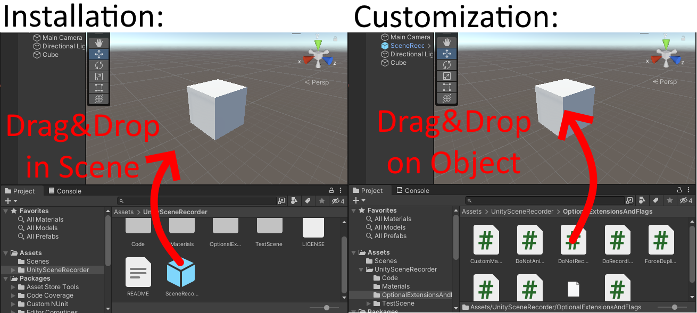
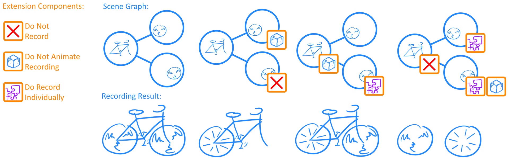
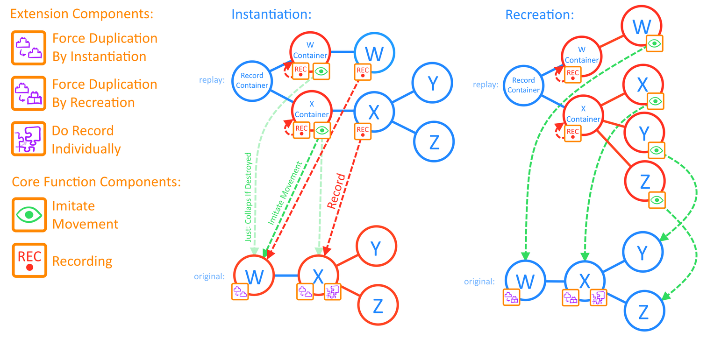
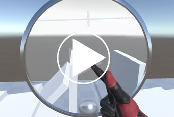
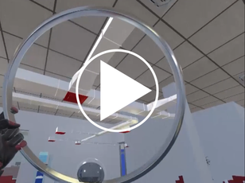
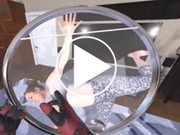

# UnitySceneRecorder
Drag&amp;Drop Unity-Asset to Record and Replay entire Scenes in the Unity Editor

UnitySceneRecorder is a tool designed to record and replay entire scenes in the Unity Editor with a focus on simple integration and generalizability for maximum compatibility, while being fully customizable. Without installation simply drag and drop the [SceneRecorderMainConfig](SceneRecorderMainConfig.prefab) into your personal Unity project and for further customization, attach extensions to GameObjects for GameObject specific features. 
As a special feature over Unity's integrated [GameObjectRecorder](https://docs.unity3d.com/2020.1/Documentation/ScriptReference/Animations.GameObjectRecorder.html) beside recording multiple GameObjects at once, UnitySceneRecorder can replay the recording as a separate model, while even displaying GameObjects which were created or destroyed during the recording. Please note that this tool relies on the UnityEditor.Animations namespace, which means it can only be used within the Unity Editor and may not support building stand-alone executables. Also storing recordings as files is not possible as Unity can't store arbitrary during runtime generated Meshes and Materials. 

## How to use

No installation is required. Just clone this Repo into the Asset folder of your Unity project. To add the recording functionality, simply attach a [SceneObserver](Code/SceneObserver.cs) Component to a GameObject in the scene at root level, or just drag and drop the already prepared [SceneRecorderMainConfig](SceneRecorderMainConfig.prefab) Prefab into the scene. To manually start a new recording, you can use the debug controls in the inspector view of the [SceneObserver](Code/SceneObserver.cs) Component. 

If you prefer the Unity package structure instead of this Asset-optimized structure, try the [Fork by SGoerzen](https://github.com/SGoerzen/UnitySceneRecorder) instead.

To start a recording via code, call SceneObserver.CreateNewSceneRecording(), which will return a [Recorder](Code/Recorder.cs) object. As soon StopRecording() gets called on it, the recording gets processed and as soon as the replay is ready, GetReplayIfFinished() will return a [Replay](Code/Replay.cs) object (instead of null). On the [Replay](Code/Replay.cs) you can call SetTime(timeInSeconds) to load a snapshot of the scene at the given time. To record a still 3D-image of the scene, call SceneObserver.CreateNewSceneSnapshot() instead and it will instantly return a Replay object.

## How to configure

Individual GameObjects can be configured by attaching Components to them. In the editor simply drag and drop the scripts from the [Optional Extensions and Flags](OptionalExtensionsAndFlags) folder onto the GameObject. When adding Components during runtime, make sure they are added before the recording starts. When adding new GameObjects during an active recording, add Components immediately after instantiation. 

### Ignoring GameObjects

To reduce CPU, RAM and GPU load during recording and replay, you can exclude GameObjects from the recording or inhibit recording an animation while still being visible in the replay. Simply attach [DoNotRecord](OptionalExtensionsAndFlags/DoNotRecord.cs) or [DoNotAnimateRecording](OptionalExtensionsAndFlags/DoNotAnimateRecording.cs) to a GameObject, which will also effect all children. To reenable recording and animation of children, attach [DoRecordIndividually](OptionalExtensionsAndFlags/DoRecordIndividually.cs) to them. This might be usefull, when the scene contains a complex but still model of a building of which only a few parts (e.g. doors) are moveable. Instead of attaching these components manually, you can also throw GameObjects into the [SceneObserver's](Code/SceneObserver.cs) public Lists in the inspector.

This figure shows the effect of combining these components in different ways:

### Changing the recording method

To replay the recording, all GameObjects must be duplicated. There are two ways with both their advantages and disadvantages:
1. Duplication by Instantiation creates an identical copy of a GameObject including all Components. Unknown components can contain logic, which can mess with the scene when running twice, so they have to be destroyed. It can happen that components can not be destroyed without error. If components can be disabled instead, have a look at [IComponentTypeExtension](Code/IComponentTypeExtension.cs). If this is also not possible choose duplication by Recreation.
2. Duplication by Recreation creates empty GameObjects for every original, attaches standard Renderer Components to it and copies Mesh and Materials over. If a GameObject has a non-standard Renderer, choose duplication by Instantiation.

In the rare case where both methods fail, the GameObject won't be recorded. 
Duplication by Recreation is the standard method. To switch the method for a GameObject, attach a [ForceDuplicationByInstantiation](OptionalExtensionsAndFlags/ForceDuplicationByInstantiation.cs) Component to the lowest GameObject in hierarchy (root GameObject). This will also affect all children in the graph (not only direct children) unless they have a [DoRecordIndividually](OptionalExtensionsAndFlags/DoRecordIndividually.cs) Component attached. Individually recorded GameObjects are treated as root GameObjects and can have their own [ForceDuplicationByInstantiation](OptionalExtensionsAndFlags/ForceDuplicationByInstantiation.cs) Component.

This figure shows further differences between both methods in the structure of the scene graph and component assignment:

### Extension System

For further project specific customization, extensions (Components which implement [IRecorderExtension](Code/IRecorderExtension.cs)) can be added to GameObjects with special need. 

- [MeshRecorderExtension](OptionalExtensionsAndFlags/MeshRecorderExtension.cs) will enable recording of the Mesh object, when attached to a GameObject with Renderer. Be aware, if you are recording large models, this will eat your RAM quickly!

- [CustomMaterialExtension](OptionalExtensionsAndFlags/CustomMaterialExtension.cs) allows you to change the Material of the replayed GameObject. 

- [VrWindowExtension](OptionalExtensionsAndFlags/VrWindowExtension.cs) reports all Materials to an [IVrWindow](Code/IVrWindow.cs) object, which can replace Shaders and has controle over Shader parameter. This can be used to add a stencil test and to discard pixels outside a certain spatial region in order make the recording only visible when looking through a window. This scene recorder is actually part of a bigger project, implementing interactable windows for VR. As soon as the refactoring is done, I will publish it on my [GitHub page](https://github.com/FloatEffect). 

## Special cases and restrictions

- The [SceneObserver](Code/SceneObserver.cs) initializes the recording functionality and keeps track of GameObjects by attaching [ObjectObserver](Code/ObjectObserver.cs) Components to GameObjects. When instantiating GameObjects from within the scene or changing the parent, make sure they don't own an [ObjectObserver](Code/ObjectObserver.cs). Either destroy it after instantiation or configure a parent of the original to be not recorded, to ensure it will be even added to already active Recorders.

- Currently there is no extension to record textures, which get baked during runtime, like textures of 2D canvases. If you build one, feel free to contribute.

- Unity's GameObjectRecorder references GameObjects by name, so this tool has to rename sibling GameObjects with the same name. This happens usually when many GameObjects are instantiated from one prefab, but in this case I don't expect them to be referenced by name.

- Be aware that displaying a recording of a whole scene will add as much GPU load, as the scene itself. [Replay](Code/Replay.cs) should be hidden by calling SetVisible(false) when they are not needed.

- Processing the finished recording can take a couple of seconds when recording large scenes for multiple minutes. The [Recorder](Code/Recorder.cs) and [Recording](Code/Recording.cs) classes are designed to return the [Replay](Code/Replay.cs) object after processing finished. In the current implementation, the screen freezes for the duration of the processing, which can be an issue in VR. If you know how to move this call into a parallel process, please let me know. Unity's Coroutines are not an option, as they require the processing to be split into multiple chunks and the Job System has no Unity API access.

- There is no way to save recordings longer than runtime as there is no way of storing during runtime generated Meshes and Materials as Prefabs. 

## Tests

If you modify the code, run the TestScene to ensure, nothing breaks. The tests result should look like this:

https://user-images.githubusercontent.com/129572908/229457361-50401c7d-ca02-4761-8476-68611e28d212.mp4

## License

This software is licensed under GPL (GNU General Public License)
For specifics see [LICENSE](LICENSE)

## Autor

Daniel Gotzen (unityscenerecorder@notjustcode.de)

